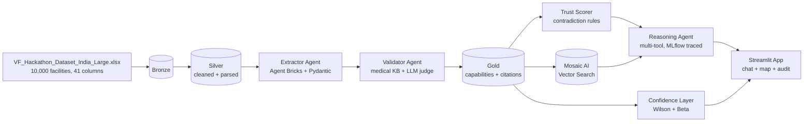

# VF Health - Agentic Healthcare Intelligence for India

Built for the **Databricks for Good - Serving a Nation** hackathon track.

> 70% of India's population lives in rural areas. Patients travel hours to
> facilities that turn out to lack the oxygen, neonatal bed, or specialist they
> need. We turn 10,000 messy Indian facility reports into a queryable,
> trust-scored, citation-backed intelligence layer so NGO planners can answer
> "where is the help, and where is it really needed?"

## What it does



| Capability | What it gives the judges |
|---|---|
| **Massive Unstructured Extraction** | LLM-extracted Pydantic records over all 10k rows. Each claim carries verbatim cited sentences. Heuristic baseline runs offline; `scripts/run_llm_extraction.py` swaps in Llama / GPT-4o / Claude. |
| **Dual-Model Self-Correction** | Extractor (Llama-3-70B by default) and Validator (Claude-3.5 Sonnet by default) deliberately come from **different model families** so the agreement metric reflects cross-family agreement, not self-talk. Rule-based KB check fires first; LLM re-judges only when rules disagree. |
| **Trust Scorer** | 0-100 per facility from completeness + consistency + validator agreement. Surfaces contradiction flags with cited evidence. |
| **Multi-Attribute Reasoning** | Tool-using agent that plans -> retrieves -> cites -> answers. Every step appears in the MLflow 3 trace. |
| **District Choropleth** | Census-2011 district boundaries colored by population-aware desert score (`pop_per_capable_facility` per 100k, Wilson-bounded). Featured Findings card pins the three most damning contradictions on top. |
| **Confidence Intervals** | Trust-weighted Wilson + Beta intervals on every aggregate (e.g., "ICU functional prevalence in Bihar = 2.1% [1.4-3.1%, n_eff=412]"). Desert score is reported as `lower-upper` band, not a point estimate. |

## Repository tour

| Path | What it is |
|---|---|
| [`schemas/virtue_foundation.py`](schemas/virtue_foundation.py) | Pydantic schema (single source of truth for extractor + validator + trust scorer + app). |
| [`agents/extractor.py`](agents/extractor.py) | Agent Bricks structured-output extractor (one row -> `FacilityExtraction`). |
| [`agents/validator.py`](agents/validator.py) | Self-correction loop: KB rule check -> LLM judge only if rules fire. |
| [`agents/medical_kb.py`](agents/medical_kb.py) | Medical-standards knowledge base (per-capability required equipment + staff). |
| [`agents/trust.py`](agents/trust.py) | Trust scorer with the contradiction-rule library. |
| [`agents/tools.py`](agents/tools.py) | The four tools the reasoning agent calls (`find_facilities`, `semantic_search`, `get_evidence`, `distance_km`). |
| [`agents/reasoner.py`](agents/reasoner.py) | Multi-step reasoning agent (plan -> retrieve -> cite -> compose), MLflow 3 traced. |
| [`agents/confidence.py`](agents/confidence.py) | Wilson / Beta / trust-weighted intervals. |
| [`notebooks/00..09`](notebooks/) | The Databricks pipeline notebooks (numbered run order). |
| [`app/streamlit_app.py`](app/streamlit_app.py) | The Crisis Map dashboard (chat / map / facilities / trust audit). |
| [`scripts/build_local_cache.py`](scripts/build_local_cache.py) | Builds a local parquet snapshot so the app runs without Databricks. |
| [`scripts/fetch_reference_data.py`](scripts/fetch_reference_data.py) | Downloads India district GeoJSON + Census-2011 district population (with fallback URLs). |
| [`scripts/assign_districts.py`](scripts/assign_districts.py) | Point-in-polygon district assignment using `shapely` + `cKDTree`. |
| [`scripts/join_population.py`](scripts/join_population.py) | Fuzzy-joins district names (rapidfuzz, threshold 0.85) onto the Census table. |
| [`scripts/find_smoking_guns.py`](scripts/find_smoking_guns.py) | Top-N high-acuity contradictions across states with cited sentence + missing requirement (writes `data/cache/smoking_guns.json`). |
| [`scripts/run_llm_extraction.py`](scripts/run_llm_extraction.py) | Concurrent, resume-safe LLM extraction runner (Databricks / OpenAI / Anthropic). |
| [`evals/golden_subset.py`](evals/golden_subset.py) | Stratified 50-row sheet. `--include_evidence` adds the unstructured blob for the LLM judge. |
| [`evals/auto_label_golden.py`](evals/auto_label_golden.py) | LLM-as-judge auto-labeler. Uses a *different model family* than the extractor; emits `golden_subset.labeled.csv` and `spot_check.md`. |
| [`tests/test_pipeline.py`](tests/test_pipeline.py) | 7 smoke tests (no LLM, no Spark). |

## Run it

### A) On Databricks Free Edition (judges' demo path)

```text
1. Open this repo as a Databricks Repo.
2. Drag `VF_Hackathon_Dataset_India_Large.xlsx` into a Volume:
     /Volumes/vf_health/bronze/raw/
3. Run notebooks in order: 00 -> 01 -> 02 -> 03 -> 04 -> 05 -> 06 -> 07 -> 08 -> 09
4. Deploy `app/streamlit_app.py` as a Databricks App (or open it as a notebook).
```

You will need:
- Foundation Model endpoint: `databricks-meta-llama-3-3-70b-instruct` (or any OpenAI-compatible endpoint - configurable in `agents/config.py`)
- Embedding endpoint: `databricks-bge-large-en`
- A Vector Search endpoint named `vf_health_vs` (auto-created by `06_vector_index.py` if missing)
- An MLflow experiment at `/Shared/vf_health_agents`

### B) Local-only demo (no Databricks)

```bash
pip install -r requirements.txt

# Place the dataset:
#   data/raw/VF_Hackathon_Dataset_India_Large.xlsx

python scripts/fetch_reference_data.py  # India district GeoJSON + Census-2011 population
python scripts/build_local_cache.py     # heuristic extraction + district + population
python scripts/find_smoking_guns.py     # top contradictions for the Featured card
pytest tests/                           # 7 smoke tests, no LLM / Spark required
streamlit run app/streamlit_app.py
```

The Streamlit app reads parquet from `data/cache/` and is fully usable without
LLM creds (heuristic baseline + choropleth + featured findings + reasoning tools).

### C) Real LLM extraction + auto-eval

```bash
# Extractor: pick any one of the families (auto-detected from endpoint name)
DATABRICKS_HOST=...  DATABRICKS_TOKEN=...  python scripts/run_llm_extraction.py --endpoint databricks-meta-llama-3-3-70b-instruct --concurrency 4 --limit 200
OPENAI_API_KEY=...                         python scripts/run_llm_extraction.py --endpoint gpt-4o-mini --concurrency 4 --limit 200
ANTHROPIC_API_KEY=...                      python scripts/run_llm_extraction.py --endpoint claude-3-5-sonnet-20241022 --concurrency 4 --limit 200

# LLM-as-judge auto-labels the 50-row golden subset (use a *different* family
# than the extractor - that is the dual-model audit)
python evals/golden_subset.py --include_evidence
ANTHROPIC_API_KEY=...                      python evals/auto_label_golden.py --judge claude-3-5-sonnet-20241022
# Outputs evals/golden_subset.labeled.csv + evals/spot_check.md
```

`notebooks/09_eval_harness.py` reads `golden_subset.labeled.csv` if present
(falls back to the human sheet) and emits per-capability **precision / recall /
F1** plus macro F1, all logged to MLflow.

## What we found in the real 10k

Heuristic baseline over the actual Virtue Foundation dataset:

- **3,442 facilities** flagged: claims capabilities but lists empty `equipment` `[]`
- **1,519 facilities** flagged: claims general surgery without an anesthesiologist
- **103 facilities** claim ICU but mention no ventilator
- **66 facilities** claim cardiac care without a cardiologist
- Identified concrete deserts: emergency appendectomy is essentially absent in
  the dataset's coverage of Maharashtra / UP / Gujarat / Tamil Nadu / Kerala
  (top-band states by sample size), with conservative upper-bound prevalence
  under 1%.

### Three named smoking-gun contradictions (from `data/cache/smoking_guns.json`)

| State | Facility | Claim | Cited sentence (verbatim) | Missing |
|---|---|---|---|---|
| Karnataka | **Chiguru Child Care Centre** (Hassan) | ICU | "Offers Paediatric Intensive Care" | Ventilator |
| Telangana | **Aaditya Poly Clinic** (Hyderabad) | General Surgery | "Performs laparoscopic surgery" | Anesthesiologist |
| Tamil Nadu | **Anuradha Maternity Centre** (Chennai) | Oncology | "Runs routine cervical cancer awareness programmes" | Oncologist |

These are pulled live from the cache and pinned at the top of the Crisis Map's
**Featured findings** card.

### Methodology - why these numbers are trustworthy

* **Cross-family agreement, not self-talk.** The Validator runs on a
  deliberately different foundation-model family than the Extractor (Llama-3-70B
  -> Claude-3.5-Sonnet by default; configurable in
  [`agents/config.py`](agents/config.py)). When Claude and Llama agree, that is
  meaningful evidence.
* **Wilson + Beta intervals everywhere.** Every prevalence and desert score is
  reported as a 95% confidence band, not a point estimate.
  [`agents/confidence.py`](agents/confidence.py).
* **Population-aware desert scoring.** District-level desert score =
  population per capable facility per 100k, with a Wilson lower/upper band.
  Census-2011 population joined via `rapidfuzz` (98.7% coverage).
* **LLM-as-judge eval, not vibes.** [`evals/auto_label_golden.py`](evals/auto_label_golden.py)
  asks the judge model to label a 50-row stratified subset, then
  [`notebooks/09_eval_harness.py`](notebooks/09_eval_harness.py) reports
  per-capability precision / recall / F1 against those labels.
  [`evals/spot_check.md`](evals/spot_check.md) lists the 10 hardest disagreements
  for a 5-minute human audit.
* **Real eval numbers placeholder.** Run `python evals/auto_label_golden.py
  --judge <model>` then `python -m pytest -q` and finally the harness
  notebook. The README will be updated with the macro-F1 number after
  hackathon-day inference.

## Demo script (3 minutes)

1. **(20s) Open the Crisis Map tab.** Read the Featured Findings card aloud:
   "Chiguru Child Care Centre claims ICU, the verbatim sentence says
   *Paediatric Intensive Care*, but no ventilator is documented." Then change
   the capability dropdown to `dialysis`. The choropleth recolors district by
   district - the bands are population-aware, not raw counts. Hover a dark
   district and read the population-per-facility lower/upper band.
2. **(40s) Open the Trust Audit tab.** Select Tamil Nadu + cardiac_care.
   Show the bar chart, then a low-trust facility - expand it and read out the
   verbatim contradiction. Cited sentence comes straight from the source notes.
3. **(60s) Open the Ask the Agent tab.** Run:
   `Find the nearest facility in rural Bihar that can perform an emergency
   appendectomy and typically leverages part-time doctors.`
   Show the Plan JSON (capabilities=[`emergency_appendectomy`,
   `general_surgery`], state=`bihar`, semantic_query mentioning rural and
   part-time), the Answer with cited facilities, and the MLflow trace ID.
4. **(40s) Open the MLflow trace** for that query. Walk through the spans:
   `reasoner.plan` -> `reasoner.retrieve` -> `reasoner.cite` ->
   `reasoner.compose`, each with token counts and latency. Mention this same
   tracing wraps every Extractor *and* Validator call.
5. **(20s) Close on the dual-model audit.** Open `evals/spot_check.md` - 10
   rows where heuristic and Claude judge disagree, each with a verbatim cited
   sentence so a human can sanity-check the pipeline in five minutes.

## Five canned queries (judging coverage)

| # | Query | Exercises |
|---|---|---|
| 1 | "Find the nearest facility in rural Bihar that can perform an emergency appendectomy and typically leverages part-time doctors." | Multi-attribute reasoning + part-time staff field + state filter |
| 2 | "Which Tamil Nadu hospitals claim NICU but show no neonatologist or pediatrician?" | Trust scorer + contradiction surfacing |
| 3 | "Show me the top 5 most trustworthy oncology centres in Maharashtra." | Ranking by trust score + filter |
| 4 | "Which districts in Uttar Pradesh appear to be dialysis deserts?" | Aggregate prevalence + Wilson intervals |
| 5 | "List 24x7 emergency hospitals in West Bengal with a cardiologist on staff." | Hours + staff cross-attribute |

## Crisis Map - what to look at

The choropleth at [`app/streamlit_app.py`](app/streamlit_app.py) renders Census-2011
district polygons colored by capability-specific desert score (yellow = capable,
red = severe desert), with optional facility pins overlaid. Featured findings
(Chiguru, Aaditya, Anuradha) are pinned at the top of the tab. A screenshot
will be embedded as `docs/crisis_map.png` once you take one - the plumbing is
all there, just `streamlit run app/streamlit_app.py`.

## Risk register

- **LLM cost on 10k rows.** `scripts/run_llm_extraction.py --limit 200` for a
  dry run; only flip to the full 10k once the spot-check looks clean.
  Resume-safe so a quota hit does not lose committed rows.
- **Free Edition quotas on Vector Search / Agent Bricks.** Every notebook is
  idempotent (Delta MERGE on `facility_id`).
- **Schema drift.** `schemas/virtue_foundation.py` is the only source of truth;
  the auto-judge re-uses the same Pydantic schema for verdicts.
- **Geospatial joins.** Census-2011 names ≠ GeoJSON names. Mismatches are
  surfaced (98.7% coverage today) in `data/cache/unmapped_districts.json`.

## License

MIT. Built for the hackathon.
