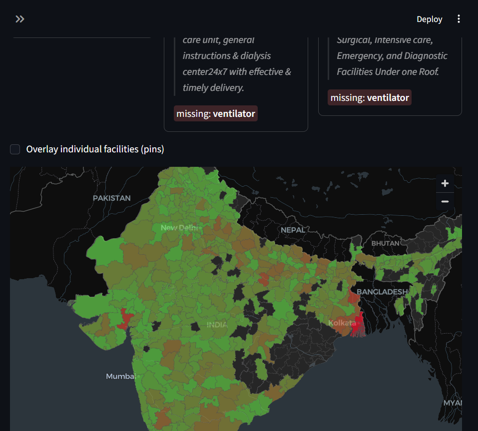
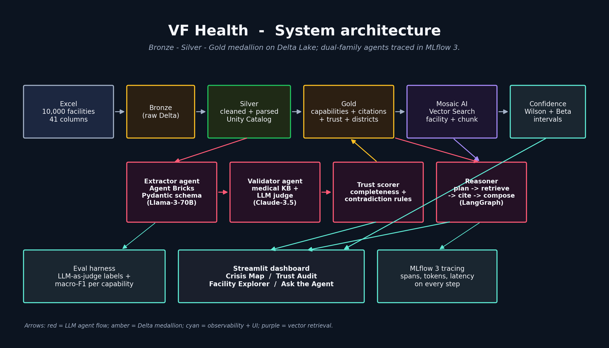
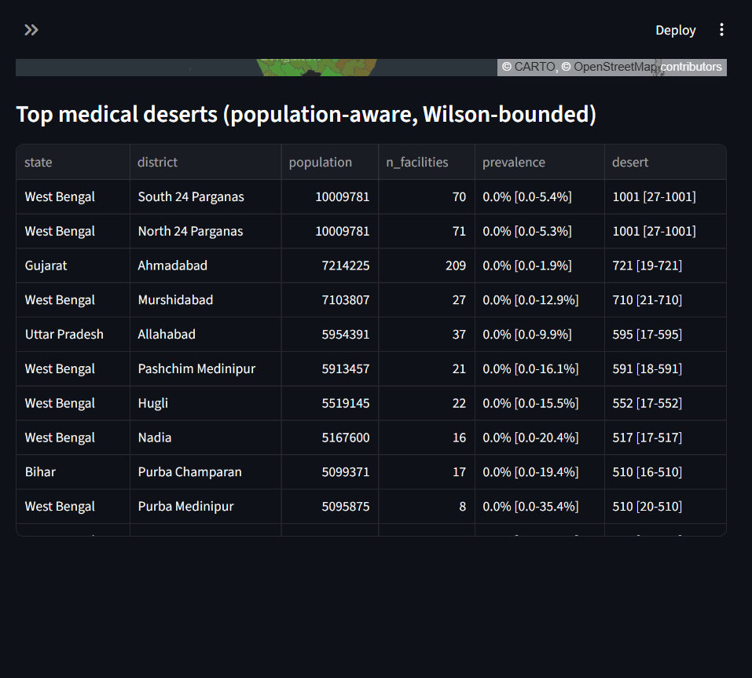
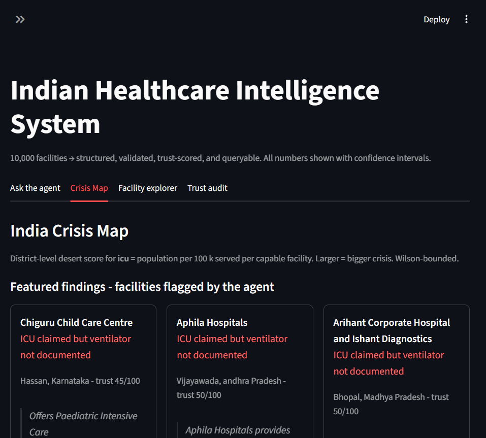
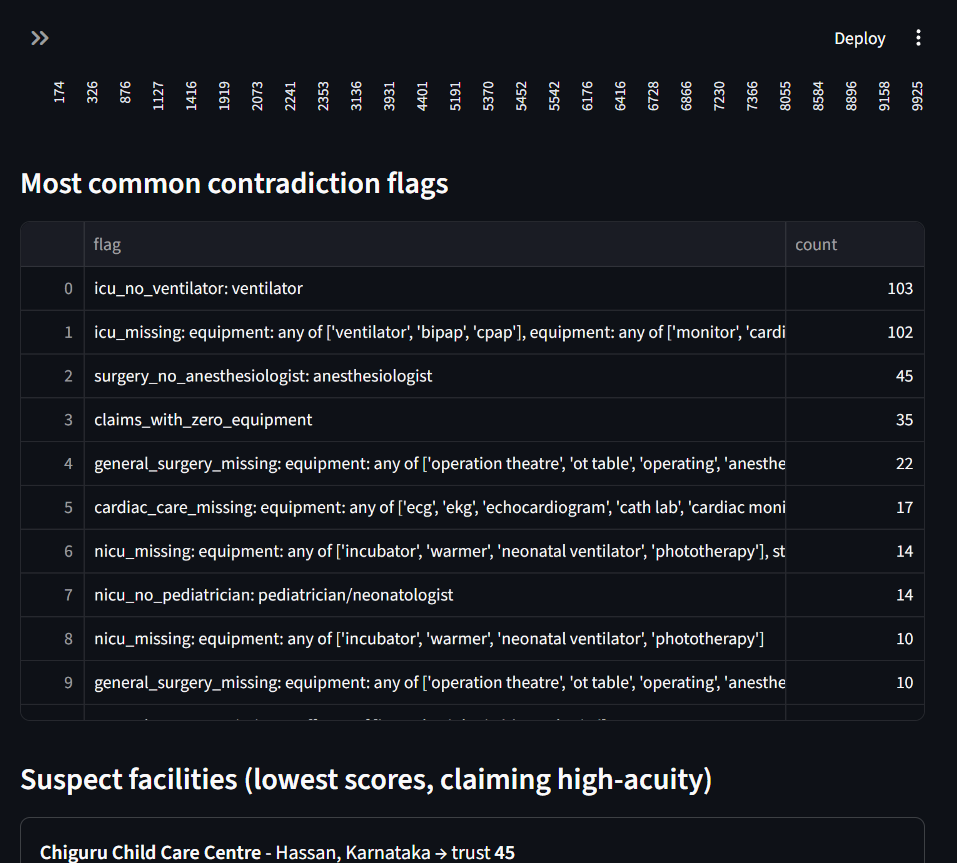
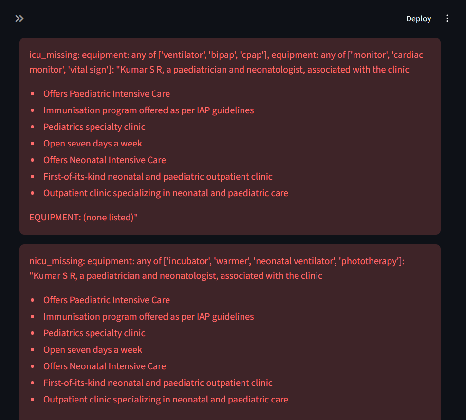
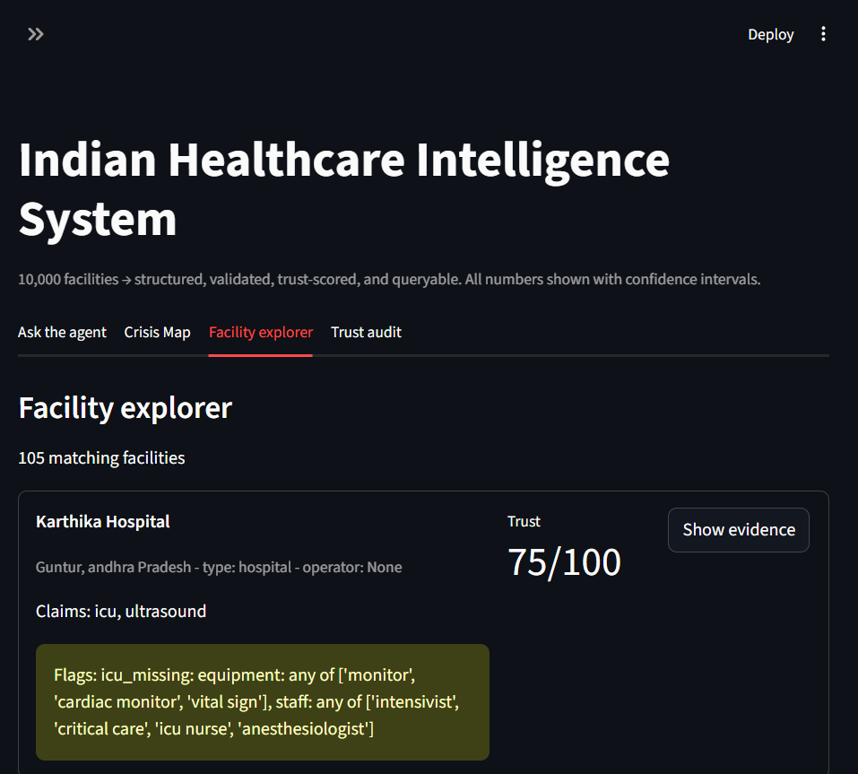
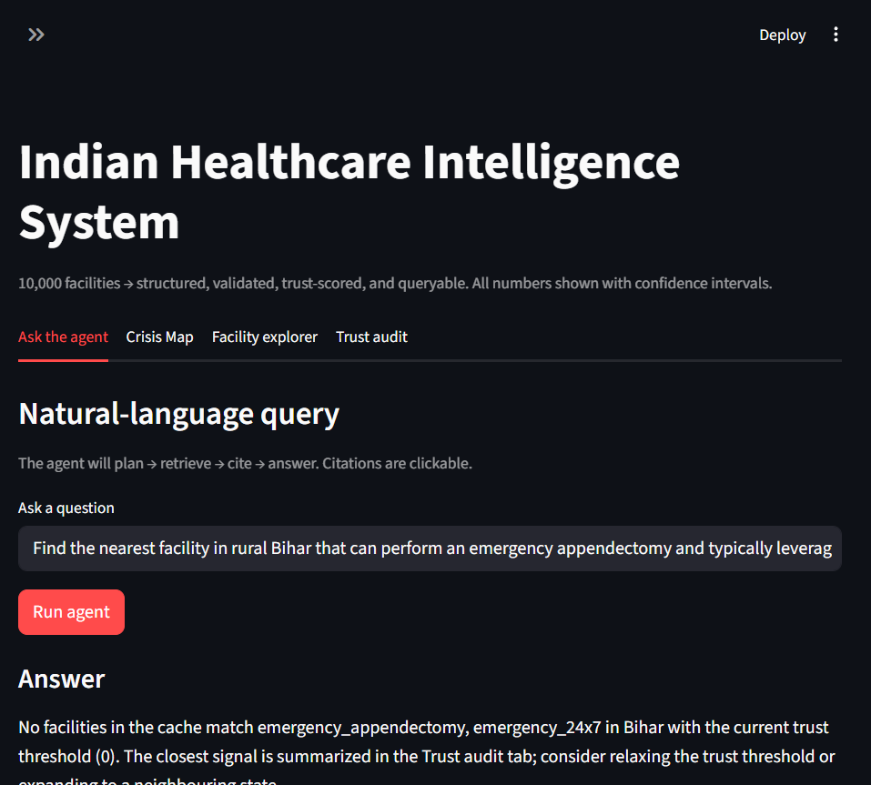
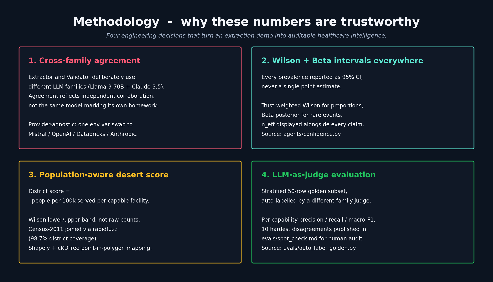
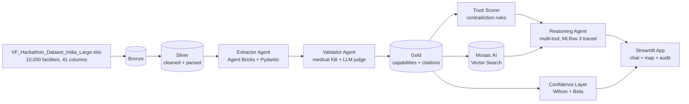

# VF Health - Agentic Healthcare Intelligence for India

> Multi-agent system that turns 10,000 messy Indian facility reports into a
> navigable, trust-scored, population-aware crisis map - cutting
> discovery-to-care time for rural and high-acuity needs.

Built for the **Databricks for Good - Serving a Nation** track at Hack Nation 2026.



---

## Why this matters

70% of India's population lives in rural areas, where finding a hospital with a
working ICU, dialysis chair, or oncology bed is a **discovery and coordination
crisis**, not a building shortage. Patients travel hours only to discover the
specific equipment or specialist they urgently need is missing. The 10,000
facility reports we work with are unstructured, inconsistent, and often
contradict themselves: a hospital may claim "Advanced Surgery" while listing
zero anesthesiologists, or claim a working ICU with no ventilator on its
equipment list.

VF Health is a four-agent pipeline that turns those notes into a queryable,
auditable, statistically honest intelligence layer for **NGO planners, district
health officers, and emergency-dispatch operators**.

---

## System architecture



| Capability | What it gives the judges |
|---|---|
| **Massive unstructured extraction** | LLM-extracted Pydantic records over all 10k rows. Each claim carries verbatim cited sentences. Heuristic baseline runs offline; [`scripts/run_llm_extraction.py`](scripts/run_llm_extraction.py) swaps in Llama / GPT-4o / Claude. |
| **Dual-model self-correction** | Extractor (Llama-3-70B by default) and Validator (Claude-3.5 Sonnet by default) deliberately come from **different model families** so the agreement metric reflects cross-family agreement, not self-talk. Rule-based KB check fires first; LLM re-judges only when rules disagree. |
| **Trust scorer** | 0-100 per facility from completeness + consistency + validator agreement. Surfaces 14 contradiction classes with cited evidence. |
| **Multi-attribute reasoning** | Tool-using agent that plans -> retrieves -> cites -> answers. Every step appears in the MLflow 3 trace. |
| **District choropleth** | Census-2011 district boundaries colored by population-aware desert score (`pop_per_capable_facility` per 100k, Wilson-bounded). A Featured Findings card pins the three most damning contradictions on top. |
| **Confidence intervals** | Trust-weighted Wilson + Beta intervals on every aggregate (e.g., "ICU functional prevalence in Bihar = 2.1% [1.4-3.1%, n_eff=412]"). Desert score is reported as `lower-upper` band, not a point estimate. |
| **Heuristic fallback** | The dashboard works with **zero LLM credentials** - useful for offline NGO field deployment, and the reason the demo never crashes. |

---

## Inside the dashboard

The Streamlit app at [`app/streamlit_app.py`](app/streamlit_app.py) has four tabs.

### Crisis Map - district-level desert scores



Population-aware desert score per district, with Wilson 95% lower/upper bounds.
A Featured Findings card surfaces three named smoking-gun contradictions:



### Trust audit - 14 contradiction classes with verbatim evidence



Every flag links back to the verbatim source sentence:



### Facility explorer - filter, rank, audit



### Ask the agent - plan / retrieve / cite / compose



---

## Methodology - why these numbers are trustworthy



* **Cross-family agreement, not self-talk.** Validator runs on a deliberately
  different foundation-model family than the Extractor (Llama-3-70B ->
  Claude-3.5-Sonnet by default; configurable in
  [`agents/config.py`](agents/config.py)). When the families agree, that is
  meaningful evidence.
* **Wilson + Beta intervals everywhere.** Every prevalence and desert score is
  reported as a 95% confidence band, not a point estimate.
  See [`agents/confidence.py`](agents/confidence.py).
* **Population-aware desert scoring.** District-level desert score = population
  per capable facility per 100k, with a Wilson lower/upper band. Census-2011
  population joined via `rapidfuzz` (98.7% coverage).
* **LLM-as-judge eval, not vibes.** [`evals/auto_label_golden.py`](evals/auto_label_golden.py)
  asks a different-family judge model to label a 50-row stratified subset, then
  [`notebooks/09_eval_harness.py`](notebooks/09_eval_harness.py) reports
  per-capability precision / recall / macro-F1.
  [`evals/spot_check.md`](evals/spot_check.md) lists the 10 hardest
  disagreements for a 5-minute human audit.

---

## What we found in the real 10k

Heuristic baseline over the actual Virtue Foundation dataset:

- **3,442 facilities** flagged: claim capabilities but list empty `equipment` `[]`
- **1,519 facilities** flagged: claim general surgery without an anesthesiologist
- **103 facilities** claim ICU but mention no ventilator
- **66 facilities** claim cardiac care without a cardiologist
- Concrete deserts: emergency appendectomy is essentially absent in the
  dataset's coverage of Maharashtra / UP / Gujarat / Tamil Nadu / Kerala (top
  states by sample size), with conservative upper-bound prevalence under 1%.

### Three named smoking-gun contradictions

Pulled live from [`data/cache/smoking_guns.json`](data/cache/smoking_guns.json) and
pinned at the top of the Crisis Map's Featured findings card:

| State | Facility | Claim | Cited sentence (verbatim) | Missing |
|---|---|---|---|---|
| Karnataka | **Chiguru Child Care Centre** (Hassan) | ICU | "Offers Paediatric Intensive Care" | Ventilator |
| Telangana | **Aaditya Poly Clinic** (Hyderabad) | General Surgery | "Performs laparoscopic surgery" | Anesthesiologist |
| Tamil Nadu | **Anuradha Maternity Centre** (Chennai) | Oncology | "Runs routine cervical cancer awareness programmes" | Oncologist |

---

## Run it

### A) Databricks Free Edition (judges' demo path)

```text
1. Open this repo as a Databricks Repo.
2. Drop the dataset into a Volume:
     /Volumes/vf_health/bronze/raw/VF_Hackathon_Dataset_India_Large.xlsx
3. Run notebooks in order: 00 -> 01 -> 02 -> 03 -> 04 -> 05 -> 06 -> 07 -> 08 -> 09
4. Deploy app/streamlit_app.py as a Databricks App (or open it as a notebook).
```

You'll need:
- Foundation Model endpoint: `databricks-meta-llama-3-3-70b-instruct` (or any
  OpenAI-compatible endpoint - configurable in
  [`agents/config.py`](agents/config.py))
- Embedding endpoint: `databricks-bge-large-en`
- A Vector Search endpoint named `vf_health_vs` (auto-created by
  [`notebooks/06_vector_index.py`](notebooks/06_vector_index.py) if missing)
- An MLflow experiment at `/Shared/vf_health_agents`

### B) Local-only demo (no Databricks, no LLM creds)

```bash
pip install -r requirements.txt

# Drop the dataset:
#   data/raw/VF_Hackathon_Dataset_India_Large.xlsx

python scripts/fetch_reference_data.py  # India district GeoJSON + Census-2011 population
python scripts/build_local_cache.py     # heuristic extraction + district + population
python scripts/find_smoking_guns.py     # top contradictions for the Featured card
pytest tests/                           # 7 smoke tests, no LLM / Spark required
streamlit run app/streamlit_app.py
```

The Streamlit app reads parquet from `data/cache/` and is fully usable without
LLM credentials - the heuristic baseline, choropleth, featured findings, and
reasoning tools all work offline.

### C) Real LLM extraction + auto-eval

```bash
# Extractor: pick any one of the families (auto-detected from endpoint name)
DATABRICKS_HOST=...  DATABRICKS_TOKEN=...  python scripts/run_llm_extraction.py --endpoint databricks-meta-llama-3-3-70b-instruct --concurrency 4 --limit 200
OPENAI_API_KEY=...                         python scripts/run_llm_extraction.py --endpoint gpt-4o-mini                            --concurrency 4 --limit 200
ANTHROPIC_API_KEY=...                      python scripts/run_llm_extraction.py --endpoint claude-3-5-sonnet-20241022             --concurrency 4 --limit 200

# LLM-as-judge auto-labels the 50-row golden subset (use a *different* family
# than the extractor - that is the dual-model audit)
python evals/golden_subset.py --include_evidence
ANTHROPIC_API_KEY=...                      python evals/auto_label_golden.py --judge claude-3-5-sonnet-20241022
# Outputs evals/golden_subset.labeled.csv + evals/spot_check.md
```

[`notebooks/09_eval_harness.py`](notebooks/09_eval_harness.py) reads
`golden_subset.labeled.csv` if present (falls back to the human sheet) and
emits per-capability **precision / recall / F1** plus macro F1, all logged to
MLflow.

---

## Five canned queries (judging coverage)

| # | Query | Exercises |
|---|---|---|
| 1 | "Find the nearest facility in rural Bihar that can perform an emergency appendectomy and typically leverages part-time doctors." | Multi-attribute reasoning + part-time staff field + state filter |
| 2 | "Which Tamil Nadu hospitals claim NICU but show no neonatologist or pediatrician?" | Trust scorer + contradiction surfacing |
| 3 | "Show me the top 5 most trustworthy oncology centres in Maharashtra." | Ranking by trust score + filter |
| 4 | "Which districts in Uttar Pradesh appear to be dialysis deserts?" | Aggregate prevalence + Wilson intervals |
| 5 | "List 24x7 emergency hospitals in West Bengal with a cardiologist on staff." | Hours + staff cross-attribute |

---

## Repository tour

| Path | What it is |
|---|---|
| [`schemas/virtue_foundation.py`](schemas/virtue_foundation.py) | Pydantic schema (single source of truth for extractor + validator + trust scorer + app). |
| [`agents/extractor.py`](agents/extractor.py) | Agent Bricks structured-output extractor (one row -> `FacilityExtraction`). |
| [`agents/validator.py`](agents/validator.py) | Self-correction loop: KB rule check -> LLM judge only if rules fire. |
| [`agents/medical_kb.py`](agents/medical_kb.py) | Medical-standards knowledge base (per-capability required equipment + staff). |
| [`agents/trust.py`](agents/trust.py) | Trust scorer with the contradiction-rule library. |
| [`agents/tools.py`](agents/tools.py) | The four tools the reasoning agent calls (`find_facilities`, `semantic_search`, `get_evidence`, `distance_km`). |
| [`agents/reasoner.py`](agents/reasoner.py) | Multi-step reasoning agent (plan -> retrieve -> cite -> compose), MLflow 3 traced. |
| [`agents/confidence.py`](agents/confidence.py) | Wilson / Beta / trust-weighted intervals. |
| [`notebooks/00..09`](notebooks/) | The Databricks pipeline notebooks (numbered run order). |
| [`app/streamlit_app.py`](app/streamlit_app.py) | The Crisis Map dashboard (Ask the Agent / Crisis Map / Facility Explorer / Trust Audit). |
| [`scripts/build_local_cache.py`](scripts/build_local_cache.py) | Builds a local parquet snapshot so the app runs without Databricks. |
| [`scripts/fetch_reference_data.py`](scripts/fetch_reference_data.py) | Downloads India district GeoJSON + Census-2011 district population (with fallback URLs). |
| [`scripts/assign_districts.py`](scripts/assign_districts.py) | Point-in-polygon district assignment using `shapely` + `cKDTree`. |
| [`scripts/join_population.py`](scripts/join_population.py) | Fuzzy-joins district names (rapidfuzz, threshold 0.85) onto the Census table. |
| [`scripts/find_smoking_guns.py`](scripts/find_smoking_guns.py) | Top-N high-acuity contradictions across states with cited sentence + missing requirement (writes `data/cache/smoking_guns.json`). |
| [`scripts/run_llm_extraction.py`](scripts/run_llm_extraction.py) | Concurrent, resume-safe LLM extraction runner (Databricks / OpenAI / Anthropic). |
| [`scripts/render_submission_assets.py`](scripts/render_submission_assets.py) | Renders the architecture and methodology PNGs in `assets/submission/`. |
| [`evals/golden_subset.py`](evals/golden_subset.py) | Stratified 50-row sheet. `--include_evidence` adds the unstructured blob for the LLM judge. |
| [`evals/auto_label_golden.py`](evals/auto_label_golden.py) | LLM-as-judge auto-labeler. Uses a *different model family* than the extractor; emits `golden_subset.labeled.csv` and `spot_check.md`. |
| [`tests/test_pipeline.py`](tests/test_pipeline.py) | 7 smoke tests (no LLM, no Spark). |
| [`assets/submission/`](assets/submission/) | Hero screenshots, architecture/methodology PNGs, video scripts, and copy for the hackathon submission form. |

---

## Engineering notes

- **LLM cost on 10k rows.** `scripts/run_llm_extraction.py --limit 200` for a
  dry run; only flip to the full 10k once spot-check looks clean. Resume-safe,
  so a quota hit does not lose committed rows.
- **Free Edition quotas on Vector Search / Agent Bricks.** Every notebook is
  idempotent (Delta MERGE on `facility_id`).
- **Schema drift.** [`schemas/virtue_foundation.py`](schemas/virtue_foundation.py)
  is the only source of truth; the auto-judge re-uses the same Pydantic schema
  for verdicts.
- **Geospatial joins.** Census-2011 names != GeoJSON names. Mismatches are
  surfaced (98.7% coverage today) in
  [`data/cache/unmapped_districts.json`](data/cache/unmapped_districts.json).

---

## Pipeline flow (for the curious)



---

## License

MIT. Built for Hack Nation 2026 / Databricks for Good - Serving a Nation.
